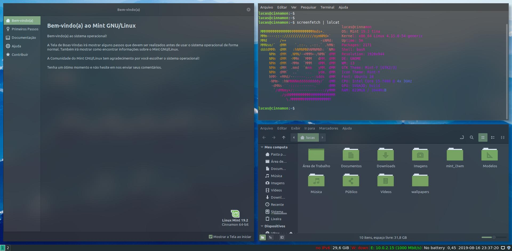
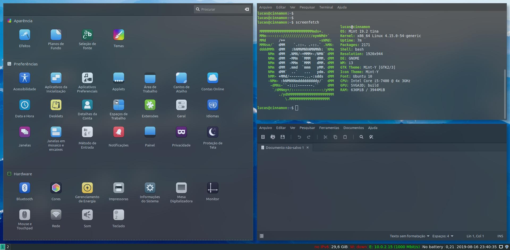
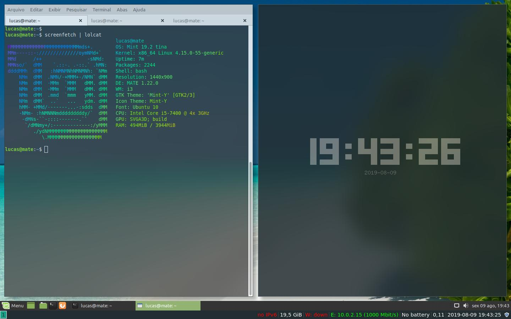
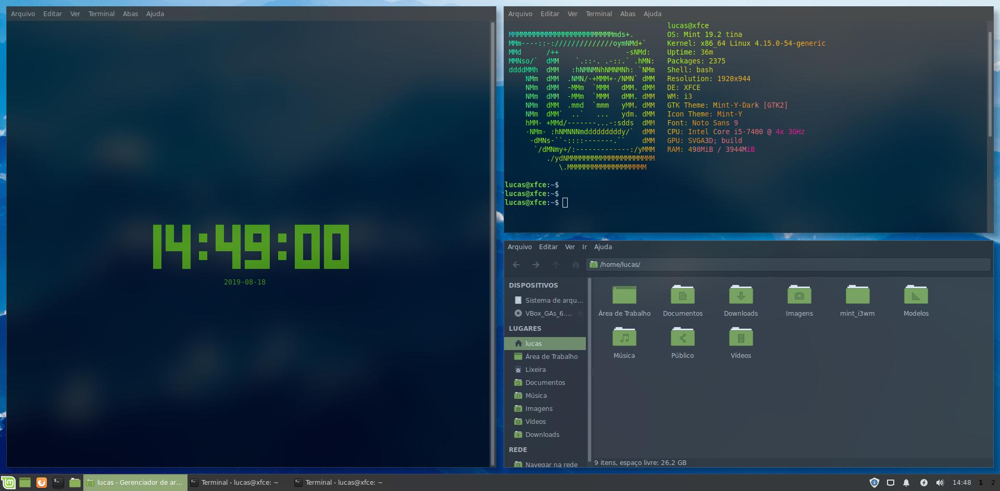
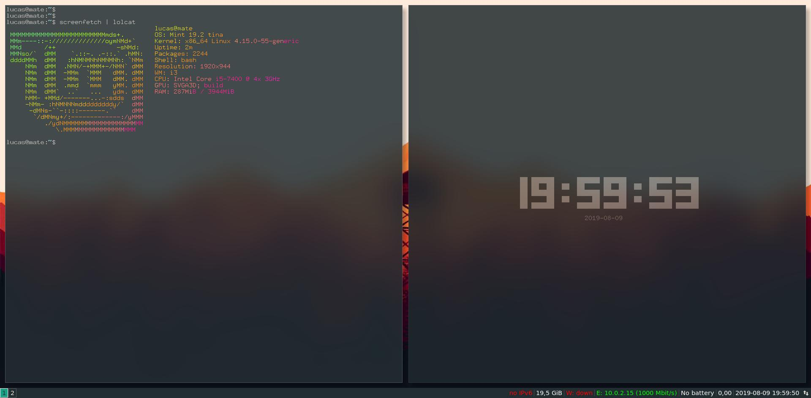

# mint_i3wm
It's a script that install _i3_ with blur effects in your _Linux_ _Mint_

## Installation

* After cloning, move the mint_i3wm inside of this project directory to your home directory(`echo ~`);
* go to terminal;
* type `cd mint_i3wm`; 
* and run `./install.sh`;

Don't type 'Y' when the question "Just run specific part?[Y/N] " appears because this option will run only the part where test which DE you are using and do specific modifications and instructions for it. \
Just use this option when you already used this script and if something is wrong, you can run one of the separated scripts too. \
The script may work on the three default Desktop Environments in Linux Mint. (_Cinnamon_, _Mate_ and _Xfce_)

## Pos-Installation

If you are in Cinnamon, in login screen click in _Cinnamon_ Logo and change to _Cinnamon+i3_, I recommend you to use _polybar_ or _synaptic_ to find program names or to have access to them more easily.

If you want to use another wallpaper changer instead of nitrogen you can do it. I recommend that you use a dark theme for better look and feel and change the wallpaper, for this use the command `nitrogen /your/path/ --set-zoom-fill` or `nitrogen /usr/share/backgrounds/linuxmint-tina/`.

## More Images

Cinnamon configuration menu (wallpaper: Blue Mountains from Linux Mint Tina, Programs: Xed, default terminal of Mint, configuration menu)

i3 with Mate (wallpaper: Maldives from Linux Mint Tina, Programs: default terminal of Mint, urxvt and 'Mint-Y' default theme)

i3 with Xfce (Programs: default terminal of Mint, thunar file manager)

Initial tests with just i3 (Programs: urxvt)

